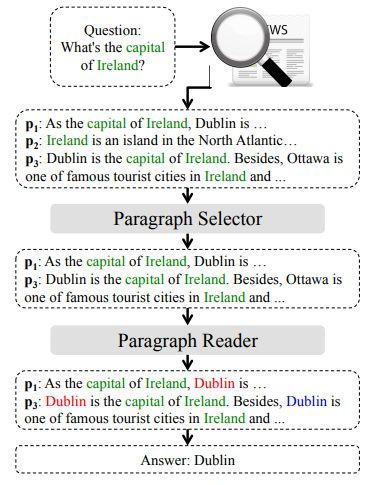
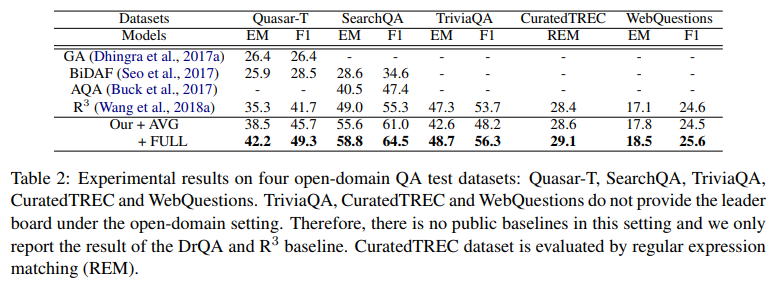

# Denoising Distantly Supervised Open-Domain Question Answering

## 一、动机

1. 现有的阅读理解系统依赖于预先确定的（预鉴定）相关文本，这些文本在开放问答（QA）场景中并不总是存在。因此，阅读理解技术不能直接应用于开放域QA的任务。（个人觉得是基于检索的对话系统方法）
2. 远程监督开放领域问答系统(distantly supervised open-domain question answering，DS-QA) ：利用信息相关技术从维基百科中获取相关文本，然后应用阅读理解技术提取答案。然而，DS-QA 容易出现噪声问题，例如下面例子，所描述的嘈杂的段落和令牌容易被视为 DS-QA 中的有效实例。

> for the question “Which country’s capital is Dublin?”, 
> (1) The retrieved paragraph “Dublin is the largest city of Ireland ...” does not actually answer the question; 
> (2) The second “Dublin” in the retrieved paragraph ‘Dublin is the capital of Ireland. Besides, Dublin is one of the famous tourist cities in Ireland and ...” is not the correct token of the answer. 

3. 远程监督开放领域问答系统(distantly supervised open-domain question answering，DS-QA) 改进：在文档中选取目标段落，然后利用阅读理解技术从目标段落中抽取正确答案。然而，因为正确答案在多个段落中被提及，并且问题的不同方面在相关段落中被回答，所以从最相关的段落中提取答案，而丢失了包含在忽视段落中的大量丰富信息。
4. 远程监督开放领域问答系统(distantly supervised open-domain question answering，DS-QA) 进一步改进：进一步明确地汇总来自不同段落的证据以重新排列提取的答案。然而，重新排名的方法仍然依赖于现有DS-QA系统所获得的答案，并且未能实质上解决DS-QA的噪声问题。

## 二、思路

论文提出了一种 coarse-to-fine denoising model for DS-QA，其思路如下所示：

> 针对问题：What’s the capital of Dublin?
>  step 1：paragraph selector 从所有检索的段落中选取两个与问题相关的段落 $p_1$ 和 $p_2$；
>  step 2：paragraph reader 从所有被选取的段落中提取 “Dublin” 的正确答案；
>  step 3：聚合所有被提取的结果以获得最后答案。

## 三、实验结果

## 四、结论

In this paper, we propose denoising distantly supervised open-domain question answering system which contains a paragraph selector to skim over paragraphs and a paragraph reader to perform an intensive reading on the selected paragraphs. Our model can make full use of all informative paragraphs and alleviate the wrong labeling problem in DS-QA. （本文提出了一种去噪远程监督开放域问答系统，该系统包括一个paragraph selector to skim over paragraphs，以及a paragraph reader to perform an intensive reading on the selected paragraphs。我们的模型可以充分利用所有的信息段落，缓解DS-QA中的错误标签问题。）

In the experiments, we show that our models significantly and consistently outperform state-of-the-art DS-QA models. In particular, we demonstrate that the performance of our model is hardly compromised when only using a few top selected paragraphs. 

In the future, we will explore the following directions: 

(1) An additional answer re-ranking step can further improve our model. We will explore how to effectively re-rank our extracted answers to further enhance the performance. 

(2) Background knowledge such as factual knowledge, common sense knowledge can effectively help us in paragraph selection and answer extraction. We will incorporate external knowledge bases into our DS-QA model to improve its performance.

