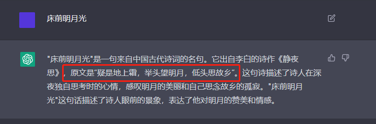

# 【关于 ChatGPT】 那些你不知道的事

> 编辑者：杨夕
> 
> NLP论文学习笔记：https://github.com/km1994/nlp_paper_study
> 
> NLP 百面百搭 地址：https://github.com/km1994/NLP-Interview-Notes
> 
> 推荐系统 百面百搭 地址：https://github.com/km1994/RES-Interview-Notes
> 
> 【关于 NLP】 那些你不知道的事 —— 搜索引擎篇: https://github.com/km1994/nlp_paper_study_search_engine
> 
> 推广搜 军火库: https://github.com/km1994/recommendation_advertisement_search

- [【关于 ChatGPT】 那些你不知道的事](#关于-chatgpt-那些你不知道的事)
  - [一、动机](#一动机)
  - [二、ChatGPT的技术原理](#二chatgpt的技术原理)
    - [2.1 ChatGPT 整体技术路线](#21-chatgpt-整体技术路线)
    - [2.2 ChatGPT 阶段一：冷启动阶段的监督策略模型](#22-chatgpt-阶段一冷启动阶段的监督策略模型)
    - [2.3 ChatGPT 阶段二：训练回报模型（Reward Model,RM）](#23-chatgpt-阶段二训练回报模型reward-modelrm)
    - [2.4 ChatGPT 阶段三：采用强化学习来增强预训练模型的能力](#24-chatgpt-阶段三采用强化学习来增强预训练模型的能力)
    - [2.5 分析](#25-分析)
  - [三、ChatGPT vs instructGPT](#三chatgpt-vs-instructgpt)
  - [四、无需账号，无地区限制，一键体验ChatGPT](#四无需账号无地区限制一键体验chatgpt)
  - [四、传统搜索是否会被取代？](#四传统搜索是否会被取代)
  - [参考](#参考)

## 一、动机

作为智能对话系统，ChatGPT最近两天爆火，都火出技术圈了，网上到处都在转ChatGPT相关的内容和测试例子，效果确实很震撼。

## 二、ChatGPT的技术原理

### 2.1 ChatGPT 整体技术路线

ChatGPT 在 GPT 3.5大规模语言模型（LLM，Large Language Model）基础上，加上了不同的策略：

1. 引入“**人工标注数据+强化学习**”（RLHF，Reinforcement Learning from Human Feedback ，这里的人工反馈其实就是人工标注数据）来不断Fine-tune预训练语言模型

- 目的：
  - 让LLM模型学会**理解人类的命令指令的含义**（比如给我写一段小作文生成类问题、知识回答类问题、头脑风暴类问题等不同类型的命令）；
  - 让LLM学会**判断对于给定的prompt输入指令**（用户的问题），**什么样的答案是优质的**（富含信息、内容丰富、对用户有帮助、无害、不包含歧视信息等多种标准）。

### 2.2 ChatGPT 阶段一：冷启动阶段的监督策略模型

- 动机：靠GPT 3.5本身，尽管它很强，但是它**很难理解人类不同类型指令中蕴含的不同意图**，也很难判断生成内容是否是高质量的结果；
- 解决方法：
  - 1. 从测试用户提交的prompt(就是指令或问题)中随机抽取一批，靠专业的标注人员，给出指定prompt的高质量答案；
  - 2. 用这些人工标注好的<prompt,answer>数据来Fine-tune GPT 3.5模型
- 优点：帮助 GPT 3.5 初步具备了理解人类prompt中所包含意图，并根据这个意图给出相对高质量回答的能力；
- 缺点：还有所不足

### 2.3 ChatGPT 阶段二：训练回报模型（Reward Model,RM）

- 动机：第一阶段Fine-tune好的冷启动模型 初步具备了理解人类prompt中所包含意图，但是显然还不够；
- 思路：
  - 1. 由冷启动后的监督策略模型为每个prompt产生K个结果，人工根据结果质量由高到低排序，以此作为训练数据；
  - 2. 通过pair-wise learning to rank模式来训练回报模型；
  - 3. 对于学好的RM模型来说，输入<prompt,answer>，输出结果的质量得分，得分越高说明产生的回答质量越高

### 2.4 ChatGPT 阶段三：采用强化学习来增强预训练模型的能力

- 特点：无需人工标注数据，而是利用上一阶段学好的RM模型，靠RM打分结果来更新预训练模型参数；
- 思路：
  - 1. **从用户提交的prompt里随机采样一批新的命令**（指的是和第一第二阶段不同的新的prompt，这个其实是很重要的，对于提升LLM模型理解instruct指令的泛化能力很有帮助），且**由冷启动模型来初始化PPO模型的参数**；
  - 2. 对于随机抽取的prompt，使用PPO模型生成回答answer， 并用上一阶段训练好的RM模型给出answer质量评估的回报分数score，这个回报分数就是RM赋予给整个回答（由单词序列构成）的整体reward；
  - 3. 有了单词序列的最终回报，就可以把每个单词看作一个时间步，把reward由后往前依次传递，由此产生的策略梯度可以更新PPO模型参数。这是标准的强化学习过程，目的是训练LLM产生高reward的答案，也即是产生符合RM标准的高质量回答；

### 2.5 分析

如果我们不断重复第二和第三阶段，很明显，每一轮迭代都使得LLM模型能力越来越强。

- 第二阶段：通过人工标注数据来增强RM模型的能力；
- 第三阶段：经过增强的RM模型对新prompt产生的回答打分会更准，并利用强化学习来鼓励LLM模型学习新的高质量内容，这起到了类似利用伪标签扩充高质量训练数据的作用，于是LLM模型进一步得到增强。

显然，第二阶段和第三阶段有相互促进的作用，这是为何不断迭代会有持续增强效果的原因。

## 三、ChatGPT vs instructGPT

- 相同点：
  - 模型结构
  - 训练流程
- 不同点：
  - ChatGPT 在收集标注数据方法上有些区别

## 四、无需账号，无地区限制，一键体验ChatGPT

目前 ChatGPT 并未开源，所以如果想 体验 ChatGPT 带来的快乐，需要：

1. 注册 ChatGPT 账号；
2. 特点地区（访问国外网络）；

有什么好的解决方法呢？

这里 分析一个 ChatGPT 镜像，可直接访问，无需账号，无区域限制。

> https://gpt.chatapi.art

## 四、传统搜索是否会被取代？

从整体来看，目前形态的chatGPT还不能取代搜索引擎，理由如下：

1. 生成内容存在错误或误导。对于不少知识类型的问题，chatGPT会给出看上去很有道理，但是事实上是错误答案的内容。

> 划红框位置，从严谨角度来看，是错误的。

2. 网络数据 每天都是 TB 级增长，chatGPT 如何去学习？

- 方法一：ChatGPT目前这种基于GPT大模型基础上进一步增加标注数据训练的模式，对于LLM模型吸纳新知识是非常不友好的。新知识总是在不断出现，而出现一些新知识就去重新预训练GPT模型是不现实的，无论是训练时间成本还是金钱成本，都不可接受。
- 方法二：如果对于新知识采取Fine-tune的模式，看上去可行且成本相对较低，但是很容易产生新数据的引入导致对原有知识的灾难遗忘问题，尤其是短周期的频繁fine-tune，会使这个问题更为严重。所以如何近乎实时地将新知识融入LLM是个非常有挑战性的问题；

3. ChatGPT或GPT4的训练成本以及在线推理成本太高，导致如果面向真实搜索引擎的以亿记的用户请求，假设继续采取免费策略，OpenAI无法承受，但是如果采取收费策略，又会极大减少用户基数，是否收费是个两难决策，当然如果训练成本能够大幅下降，则两难自解

## 参考

1. [张俊林：ChatGPT会成为下一代搜索引擎吗](https://mp.weixin.qq.com/s/V0BTumv8Ax5ToMn8V2DdAA)

