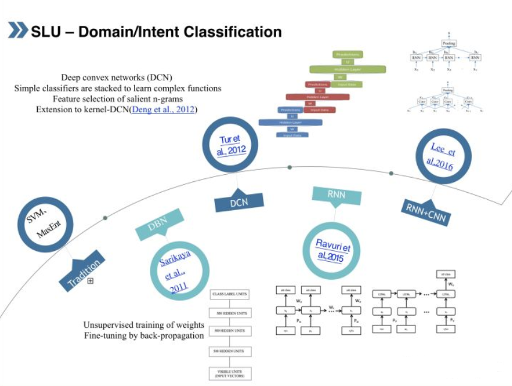
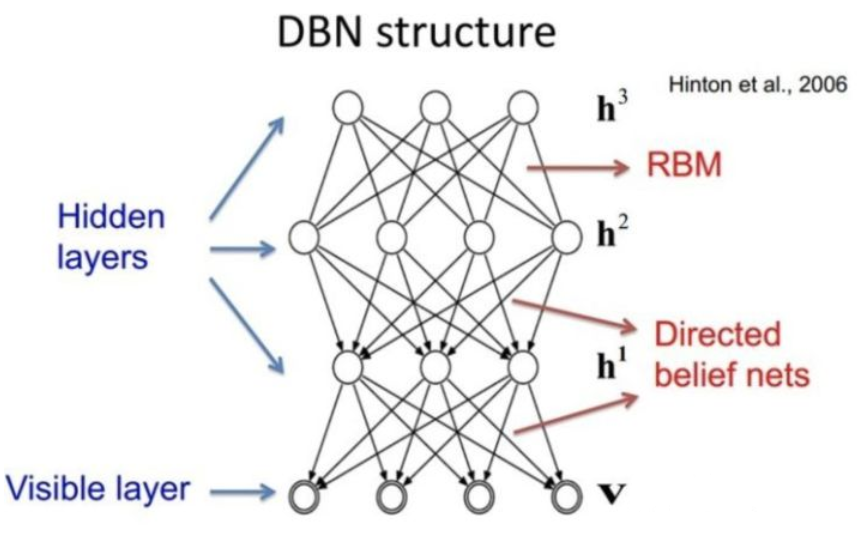
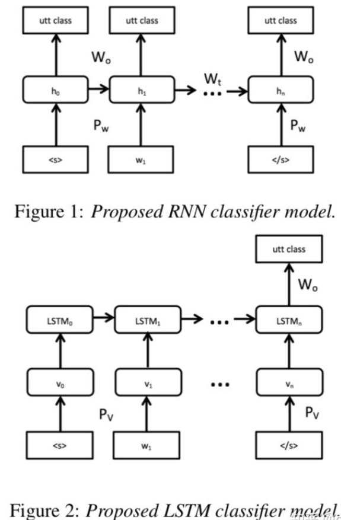
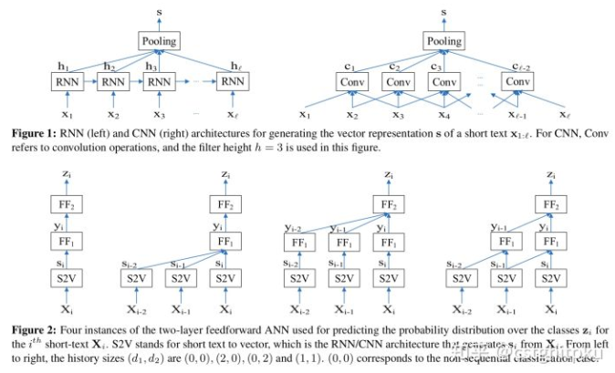

# 【关于 Domain/Intent Classification 】那些你不知道的事

> 作者：杨夕
> 
> 项目地址：https://github.com/km1994/nlp_paper_study
> 
> 个人介绍：大佬们好，我叫杨夕，该项目主要是本人在研读顶会论文和复现经典论文过程中，所见、所思、所想、所闻，可能存在一些理解错误，希望大佬们多多指正。
> 
> 致谢：感谢 [cstghitpku](https://www.zhihu.com/people/cangshengtage) 大佬 所写的文章 【总结|对话系统中的口语理解技术(SLU)（一）】(https://zhuanlan.zhihu.com/p/50095779)，在学习该 文章时，边学习边总结重要信息。如有侵权，请通知本人删除博文！

## 一、目录

1. [什么是自然语言理解(NLU)？](#什么是自然语言理解(NLU)？)
2. [自然语言理解(NLU)流程是怎么样？](#自然语言理解(NLU)流程是怎么样？)
3. [在不同的对话系统中，NLU的区别在哪？](#在不同的对话系统中，NLU的区别在哪？)
4. [任务型对话系统中的NLU的发展历程？](#任务型对话系统中的NLU的发展历程？)
5. [任务型对话系统中的NLU的传统方法介绍？](#任务型对话系统中的NLU的传统方法介绍？)
6. [任务型对话系统中的NLU的深度学习方法介绍？](#任务型对话系统中的NLU的深度学习方法介绍？)

## 二、内容

### 什么是自然语言理解(NLU)？

自然语言理解(NLU)就是要获得一个计算机能直接使用的语义表示，比如Distributional semantics、Frame semantics、Model-theoretic semantics等，本文采用的是frame semantics。NLU在很多NLP领域或任务都有涉及，比如问答、信息检索、阅读理解、对话系统以及很多需要NLG的任务(一般需要先理解才能生成)等。不同任务下的NLU也不一样，今天我们简单来聊聊对话系统中的NLU。

### 自然语言理解(NLU)流程是怎么样？

- 流程：
  - s1：领域分类 and 意图分类；
  - s2：写槽填充；
  - s3：Structural LU、Contextual LU、各种NLU方法的对比以及评测标准；

### 在不同的对话系统中，NLU的区别在哪？

- 对话系统类别：
  - 闲聊型
    - NLU 作用介绍：根据上下文进行**意图识别**、**情感分析**等， 并作为对话管理（DM）的输入；
  - 任务型
    - NLU 作用介绍：**领域分类**和**意图识别**、**槽填充**。他的输入是用户的输入Utterance，输出是Un=（In, Zn), In是intention，Zn是槽植对；
  - 知识问答型
    - NLU 作用介绍：根据用户的问题，进行**问句类型识别**与**问题分类**，以便于更精准的进行信息检索或文本匹配而生成用户需要的知识（知识、实体、片段等）；
  - 推荐型
    - NLU 作用介绍：根据用户各种行为数据和爱好进行兴趣匹配，以便于找到更精准的推荐候选集

### 任务型对话系统中的NLU的发展历程？

下图为 Domain/Intent Classification 的 发展历程

### 任务型对话系统中的NLU的传统方法介绍？

- 传统方法：
  - 模型：MaxEnt or SVM (几个不同变种、几种不同核函数等)；
- 特征：
  - 用户的输入Utterance的句法、词法、词性等特征；
- 分类 label ：需要事先确定

### 任务型对话系统中的NLU的深度学习方法介绍？

####  [DBN-Based（Sarikaya et al., 2011）](https://ieeexplore.ieee.org/abstract/document/5947649)

- 名称：Deep belief network
- 类型：生成模型
- 组成：
  - 多个限制玻尔兹曼机（Restricted Boltzmann Machines）层组成，被“限制”为可视层和隐层，层间有连接，但层内的单元间不存在连接。隐层单元被训练去捕捉在可视层表现出来的高阶数据的相关性。
- 思路：
  - 利用无监督训练权重；
  - 利用 BP 进行 Fine-tuning

####  [DCN-Based （Tur et al., 2012）](https://ieeexplore.ieee.org/abstract/document/6289054)

- 名称：基于Deep convex network(一种可扩展的模式分类体系结构)做NLU
- 思路：
  - s1：用n-grams对用户的Utterance做特征选择；
  - s2：把简单的分类器做Stacking，Stacking跟Bagging与Boosting一样，也是一种ensemble的方法。Stacking指训练一个模型用于组合其他各个模型，在这里相当于二次分类。首先训练多个不同的模型，然后把训练的各个模型的输出作为输入来训练一个模型以得到最终输出。

####  [RNN-Based(Ravuri et al., 2015)](https://www.microsoft.com/en-us/research/wp-content/uploads/2016/02/RNNLM_addressee.pdf)

####  [RNN+CNN based（Lee et al,2016）](https://arxiv.org/pdf/1603.03827.pdf)

- 介绍：用RNN+CNN做对话的act分类，提出了基于RNN和CNN并融合preceding short texts的模型。短文本如果出现在一个序列中，使用preceding short texts可能提高分类效果，这就是本文的最大的动机和创新点；
- 思路：
  - 使用RNN/CNN把短文本变成向量表示；
  - 基于文本的向量表示和preceding short texts做act分类

## 三、个人总结

看完这篇文章，你是不是和我一样觉得 无论是 **意图识别**、**情感分析**、**领域分类**、**问句类型识别**、**问题分类**，其实都是 一类分类问题。

## 四、参考

1. [总结|对话系统中的口语理解技术(SLU)（一）](https://zhuanlan.zhihu.com/p/50095779)
