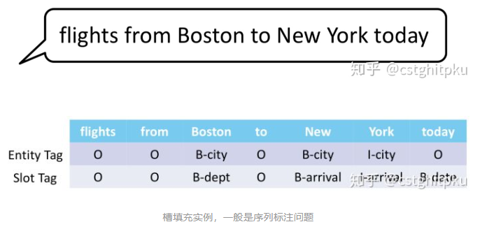

# 【关于 槽位填充 (Slot Filling)】那些你不知道的事

> 作者：杨夕
> 
> 项目地址：https://github.com/km1994/nlp_paper_study
> 
> 个人介绍：大佬们好，我叫杨夕，该项目主要是本人在研读顶会论文和复现经典论文过程中，所见、所思、所想、所闻，可能存在一些理解错误，希望大佬们多多指正。
> 
> 致谢：感谢 [cstghitpku](https://www.zhihu.com/people/cangshengtage) 大佬 所写的文章 【总结|对话系统中的口语理解技术(SLU)（二）】(https://zhuanlan.zhihu.com/p/50347509)，在学习该 文章时，边学习边总结重要信息。如有侵权，请通知本人删除博文！

## 一、目录

1. [什么是槽位填充 (Slot Filling)？](#什么是槽位填充(Slot_Filling)？)
2. [槽位填充的发展历程？](#槽位填充的发展历程？)
3. [槽位填充的传统方法介绍？](#槽位填充的传统方法介绍？)
4. [槽位填充的深度学习方法介绍？](#槽位填充的深度学习方法介绍？)

## 二、内容

### 什么是槽位填充(Slot_Filling)？

### 槽位填充的发展历程？

## 三、个人总结

看完这篇文章，你是不是和我一样觉得 无论是 **槽位填充**，其实都是 一类系列标注问题问题。

## 四、参考资料

1. 【总结|对话系统中的口语理解技术(SLU)（二）】(https://zhuanlan.zhihu.com/p/50347509)