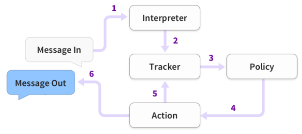

# 【关于 rasa 安装 】那些你不知道的事

> 作者：杨夕
> 
> 项目地址：https://github.com/km1994/nlp_paper_study
> 
> 个人介绍：大佬们好，我叫杨夕，该项目主要是本人在研读顶会论文和复现经典论文过程中，所见、所思、所想、所闻，可能存在一些理解错误，希望大佬们多多指正。
> 

## 目录

- [【关于 rasa 安装 】那些你不知道的事](#关于-rasa-安装-那些你不知道的事)
  - [目录](#目录)
  - [一、安装 Rasa](#一安装-rasa)
  - [二、安装 python 工具包](#二安装-python-工具包)
  - [三、sklearn  和 MITIE 库 安装](#三sklearn--和-mitie-库-安装)
  - [四、项目初尝试](#四项目初尝试)
    - [4.1 创建新项目](#41-创建新项目)
    - [4.2 模型训练](#42-模型训练)
    - [4.3 测试](#43-测试)
  - [Rasa 命令行 备忘录](#rasa-命令行-备忘录)
  - [Rasa 架构](#rasa-架构)
  - [问题记录](#问题记录)
    - [InvalidPolicyConfig: Module for policy 'KerasPolicy' could not be loaded. Please make sure the name is a valid policy.](#invalidpolicyconfig-module-for-policy-keraspolicy-could-not-be-loaded-please-make-sure-the-name-is-a-valid-policy)
  - [参考资料](#参考资料)


## 一、安装 Rasa 

> 温馨提示：由于 安装 Rasa 过程中，会安装各种 乱七八糟的 依赖库（eg：tensorflow 2.0，...），导致 安装失败，所以建议 用 conda ，新建 一个 conda 环境，然后在 该环境上面开发。

- 创建环境
```
  $ conda create -n rasa python=3.6
```
- 激活环境
```
  $conda activate rasa
```

## 二、安装 python 工具包

```
  $pip install -r install/rasa2.txt
```

## 三、sklearn  和 MITIE 库 安装

```shell
  pip install -U scikit-learn sklearn-crfsuite
  pip install git+https://github.com/mit-nlp/MITIE.git
```

> 注：MITIE 库比较大，所以这种 安装方式容易出现问题，所以我用另一种安装方式

```shell
  $ git clone https://github.com/mit-nlp/MITIE.git
  $ cd MITIE/
  $ python setup.py install
```

安装结果

```shell
  Compiling src/text_feature_extraction.cpp
  ...
  byte-compiling /home/amy/.conda/envs/yangkm/lib/python3.6/site-packages/mitie/__init__.py to __init__.cpython-36.pyc
  byte-compiling /home/amy/.conda/envs/yangkm/lib/python3.6/site-packages/mitie/mitie.py to mitie.cpython-36.pyc
  running install_egg_info
  Writing /home/amy/.conda/envs/yangkm/lib/python3.6/site-packages/mitie-0.7.0-py3.6.egg-info
```
> 注：会存在 一些 warning 警告，对结果 影响不大

## 四、项目初尝试

### 4.1 创建新项目

1. 第一步是创建一个新的Rasa项目。要做到这一点，运行下面的代码:
  
- 启动 Rasa 
  
```python
    rasa init --no-prompt
```

> 注：rasa init命令创建rasa项目所需的所有文件，并根据一些示例数据训练一个简单的机器人。如果你省略了——no-prompt参数，将会询问你一些关于项目设置的问题。

- 运行过程

```shell
$ rasa init --no-prompt
Welcome to Rasa! 🤖

To get started quickly, an initial project will be created.
If you need some help, check out the documentation at https://rasa.com/docs/rasa.

Created project directory at '/web/workspace/yangkm/python_wp/nlu/DSWp'.
Finished creating project structure.
Training an initial model...
Training Core model...
Processed Story Blocks: 100%|█████████████████████████████████████████████| 5/5 [00:00<00:00, 3562.34it/s, # trackers=1]
...
Your Rasa model is trained and saved at '/web/workspace/yangkm/python_wp/nlu/DSWp/models/20200917-164632.tar.gz'.
If you want to speak to the assistant, run 'rasa shell' at any time inside the project directory.
```

- 运行结果

将在该目录下参加以下文件：

<table>
    <thead>
        <td>文件名称</td><td>作用说明</td>
    </thead>
    <tr>
        <td>init.py</td><td>帮助python查找操作的空文件</td>
    </tr>
    <tr>
        <td>actions.py</td><td>为你的自定义操作编写代码</td>
    </tr>
    <tr>
        <td>config.yml ‘*’</td><td>配置NLU和Core模型</td>
    </tr>
    <tr>
        <td>credentials.yml</td><td>连接到其他服务的详细信息</td>
    </tr>
    <tr>
        <td>data/nlu.md ‘*’</td><td>你的NLU训练数据</td>
    </tr>
    <tr>
        <td>data/stories.md ‘*’</td><td>你的故事</td>
    </tr>
    <tr>
        <td>config.yml ‘*’</td><td>配置NLU和Core模型</td>
    </tr>
    <tr>
        <td>domain.yml ‘*’</td><td>你的助手的域</td>
    </tr>
    <tr>
        <td>endpoints.yml</td><td>接到fb messenger等通道的详细信息</td>
    </tr>
    <tr>
        <td>models/.tar.gz</td><td>你的初始模型</td>
    </tr>
</table>

> 注：最重要的文件用“*”标记。你将在本教程中了解所有这些文件。


### 4.2 模型训练

每当我们添加新的NLU或Core数据，或更新域或配置时，我们都需要根据示例故事和NLU数据重新训练一个神经网络。为此，运行下面的命令。该命令将调用Rasa Core和NLU训练函数，并将训练后的模型存储到models/目录中。该命令只会在数据或配置发生更改时自动对不同的模型部件进行重新训练。

```s
  rasa train
  echo "Finished training."
```

rasa train命令将同时查找NLU和Core数据，并训练一个组合模型。

### 4.3 测试

恭喜你! 🚀 你刚刚建立了一个完全由机器学习驱动的助手。 下一步就是尝试一下!如果你正在本地机器上学习本教程，请运行以下命令与助手对话：

```shell
  
  $ rasa shell
  2020-09-17 19:44:19 INFO     root  - Connecting to channel 'cmdline' which was specified by the '--connector' argument. Any other channels will be ignored. To connect to all given channels, omit the '--connector' argument.
  2020-09-17 19:44:19 INFO     root  - Starting Rasa server on http://localhost:5005
  2020-09-17 19:44:26 INFO     root  - Rasa server is up and running.
  Bot loaded. Type a message and press enter (use '/stop' to exit): 
  Your input ->  hello                                                                                                    
  Hey! How are you?
  Your input ->  i'm fine                                                                                                 
  Great, carry on!
  Your input ->  Did that help you                                                                                        
  I am a bot, powered by Rasa.
  Your input ->  are you a human?                                                                                         
  I am a bot, powered by Rasa.
  Your input ->  am I talking to a bot?                                                                                   
  I am a bot, powered by Rasa.
  Your input ->  see you around                                                                                           
  Bye
  Your input ->  of course                                                                                                
  Great, carry on!
  Your input ->  I don't think so                                                                                         
  Bye
  Your input ->  no way                                                                                                   
  Bye
  Your input ->  I am feeling very good                                                                                   
  Great, carry on!
  Your input ->  very bad                                                                                                 
  Here is something to cheer you up:
  Image: https://i.imgur.com/nGF1K8f.jpg
  Did that help you?
  Your input ->  are you a bot?                                                                                           
  I am a bot, powered by Rasa.
```


## Rasa 命令行 备忘录

<table>
  <thead>
      <td>命令</td><td>作用说明</td>
  </thead>
  <tr>
      <td>rasa init</td><td>使用示例训练数据，操作和配置文件创建新项目</td>
  </tr>
  <tr>
      <td>rasa train</td><td>使用你的NLU数据和故事训练模型，在./model中保存训练的模型</td>
  </tr>
  <tr>
      <td>rasa interactive</td><td>启动交互式学习会话，通过聊天创建新的训练数据</td>
  </tr>
  <tr>
      <td>rasa shell</td><td>加载已训练的模型，并让你在命令行上与助手交谈</td>
  </tr>
  <tr>
      <td>rasa run</td><td>使用已训练的的模型启动Rasa服务。有关详细信息，请参阅运行服务文档</td>
  </tr>
  <tr>
      <td>rasa run actions</td><td>使用Rasa SDK启动操作服务</td>
  </tr>
  <tr>
      <td>rasa visualize</td><td>可视化故事</td>
  </tr>
  <tr>
      <td>rasa test</td><td>使用你的测试NLU数据和故事测试已训练的Rasa模型</td>
  </tr>

  <tr>
      <td>rasa data split nlu</td><td>根据指定的百分比执行NLU数据的拆分</td>
  </tr>
  <tr>
      <td>rasa data convert nlu</td><td>在不同格式之间转换NLU训练数据</td>
  </tr>
  <tr>
      <td>rasa x</td><td>在本地启动Rasa X</td>
  </tr>
  <tr>
      <td>rasa -h</td><td>显示所有可用命令</td>
  </tr>
</table>

具体介绍，可以查看 [Rasa 命令行界面](http://rasachatbot.com/3_Command_Line_Interface/)

## Rasa 架构 



- Rasa构建的助手如何响应消息的基本步骤：
  - 1. 收到消息并将其传递给解释器(Interpreter)，解释器将其转换为包含原始文本，意图和找到的任何实体的字典。这部分由NLU处理;
  - 2. 跟踪器(Tracker)是跟踪对话状态的对象。它接收新消息进入的信息;
  - 3. 策略(Policy)接收跟踪器的当前状态。 该策略选择接下来采取的操作(action)。 
  - 4. 选择的操作由跟踪器记录。 
  - 5. 响应被发送给用户。

## 问题记录

### InvalidPolicyConfig: Module for policy 'KerasPolicy' could not be loaded. Please make sure the name is a valid policy.

> 参考：[InvalidPolicyConfig:未能加载策略“”KerasPolicy“”的模块。“”请确保该名称是有效的策略](https://cloud.tencent.com/developer/ask/sof/273619)

- 问题描述

执行 $ rasa train 之后，出现这个错误

```s
    $ InvalidPolicyConfig: Module for policy 'KerasPolicy' could not be loaded. Please make sure the name is a valid policy.
```

- 问题定位：Rasa 2.0中弃用了Keras策略，取而代之的是TED策略
- 解决方法

> 原始 config.yml 去掉 KerasPolicy 

```s
language: "zh"
...
policies:
  - name: KerasPolicy
    epochs: 100
    max_history: 5
  ...
```

> 改为

```s
language: "zh"
...
policies:
  - name: TEDPolicy
    epochs: 10
    max_history: 5
  ...
```


## 参考资料

1. [Rasa 安装](http://rasachatbot.com/2_Rasa_Tutorial/#rasa)
2. [Rasa 聊天机器人中文官方文档|磐创AI](http://rasachatbot.com/)
3. [Rasa 学习](https://blog.csdn.net/ljp1919/category_9656007.html)
4. [rasa_chatbot_cn](https://github.com/GaoQ1/rasa_chatbot_cn)
5. [用Rasa NLU构建自己的中文NLU系统](http://www.crownpku.com/2017/07/27/用Rasa_NLU构建自己的中文NLU系统.html)
6. [Rasa_NLU_Chi](https://github.com/crownpku/Rasa_NLU_Chi)
7. [_rasa_chatbot](https://github.com/zqhZY/_rasa_chatbot)
8. [rasa 源码分析](https://www.zhihu.com/people/martis777/posts)
9. [Rasa开发使用 Rasa_NLU及Rasa_Core模型训练与测试](https://blog.csdn.net/ling620/article/details/99845885)